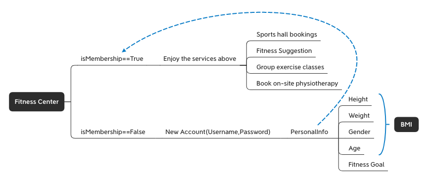
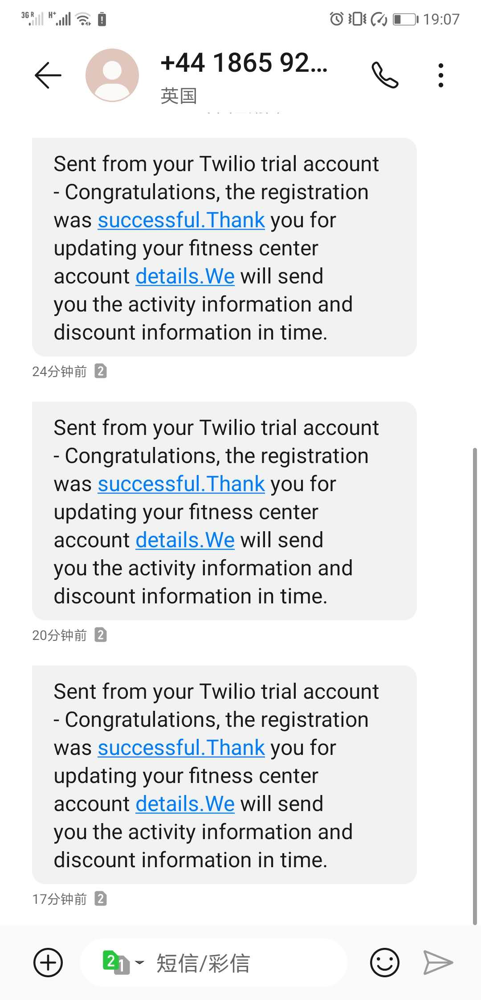

<center>
  <h1>ChatBot<h1/>
</center>

## Project brief

Chatbots are computer programs that conduct conversations and are often designed to convincingly simulate the way humans behave as conversation partners. The **fitness center chatbot** is dedicated to using the NLTK feature to identify key words and help customers with simple authentication, registration information and sending a "successful registration" confirmation message, access to help information and booking services. In addition to professional customer service, the chatbot can answer daily greetings and non-professional questions about the weather or local times.


The general structure information is shown in the figure below：




## Final prototype

When you RUN the file of [Test.py](https://github.coventry.ac.uk/liaoy19/fitnessCenterChatBot/blob/master/project/liaoy19/Test.py), you can get many detail of the chatbot.

In addition to providing normal chat (greeting, asking about vacation status, asking time, and weather) in addition to inquiry, this chat robot also provides registered accounts, login accounts, get fitness advice, get course schedules, get specific distances on the map, And team sports information.

You can ask when the test file runs:
what time is it now? 
How's the weather today?   
I want to register/login. 
What is the class detail?

Or you can ask for more information about sentences that contain keywords from the [Greeting file](https://github.coventry.ac.uk/liaoy19/fitnessCenterChatBot/blob/master/project/liaoy19/Greeting.py).

#### note:

The original member registration information is saved in the  [CSV file](https://github.coventry.ac.uk/liaoy19/fitnessCenterChatBot/blob/master/project/liaoy19/marks_test.csv). If you want to test login you can use the information in the [CSV file](https://github.coventry.ac.uk/liaoy19/fitnessCenterChatBot/blob/master/project/liaoy19/marks_test.csv). The UserID and password are columns 2 and 3 in the CSV fil.

When you successfully sign up for a new user, you will be asked if you can get permission to use your phone number and will attempt to send a text message containing confirmation to that phone number. However, because the advanced API requires payment, the advanced function of the API for sending and receiving SMS cannot be enabled, that is, the mobile phone number without manual verification cannot be sent a confirmation message. The current verified mobile phone number is 7985571159,and the And the test result is



```python
>>> hi
May I help you?
>>> hola
What I can do for you?
>>> what time is it
2020-03-19 18:46:29
>>> how is the weather
Enter city name : London
 Temperature (in kelvin unit) = 280.38
 atmospheric pressure (in hPa unit) = 1026
 humidity (in percentage) = 93
 description = light intensity drizzle
>>> I wanna go to class
sorry, you need login at first(Press 'return' to be continue)
Please enter userID:Ann689
Please enter your passwordQWEqwe456$$
Correct UserID.
welcome!
Here are some home workout videos to try.
https://www.youtube.com/results?search_query=home+workout
Welcome to the classes section, 
we have various type of classes, 
which class would you like to join, 
we have productive gym sessions, 
different sports, dance classes 
and also we have yoga classes, 
Thankyou.(enter'gym')
gym
Would you like a personal gym trainer or join a group gym class.(enter 'personal')
persona;
what you said was not in the options, please chose again.(enter'dave,dominic,caro,fiona or craig')
Would you like a personal gym trainer or join a group gym class.(enter 'personal')
personal
These are the lists of personal trainers we have, 
please use name to choose one below and proceed to payment.
<module 'project.moham977.trainers' from '/Users/liaoyan/PycharmProjects/chatBot/project/moham977/trainers.py'>

What you said was not in the list, 
please check the spelling of the name and type again.
(enter'dave,dominic,caro,fiona or craig')
dave
<Response [200]>
The price is £50
please call dave.
If you wanna get more information about group exercises,please enter something about 'group'.
>>> group
sorry, you need login at first
Please enter userID:
Please enter your password
your password or UserID is not valid, please try again,
if you wanna exit the login system,please enter"No",if you wanna login again,
please press "return" to be continueNo
Please try typing 'login'
PLEASE ENTER YOUR GENDER(if you wanna quit,please enter No):No
>>> I wanna register
=========REGISTER=========
Enter your Username:abc
Enter your password:123
What is your gender:F
How old are you:23
please enter your weight(kg):80
please enter your height:1.8
Not Valid! The password should contain at least two characters of a-z
False
please reset the password abc123
registration was successful
==============your detail==============
username: abc
gander: F
age: 23
weight: 80.0
height: 1.8
=======================================
Would you like to receive more relevant information via SMS?(yes/no)yes
Please enter your phone number7985571159
SMa2883f38fca34c168f864f5956386fec
Do you want to calculate your BMI and your health condition(yes/no):yes
Your health result
BMI: 24.691358024691358
Normal (healthy weight)	
=======================================
What I can do for you?
Do you want get some information about the class or group exercises?(yes/no)yes
Here are some home workout videos to try.
https://www.youtube.com/results?search_query=home+workout
Thanks for coming to our classes section. 
What section would you like to join today 
we have amazing gym training classes, 
different varieties of sports, 
dances classes and yoga classes also, 
Thankyou.(enter'gym')
gym
Would you like a personal gym trainer or join a group gym class.(enter 'personal')
personal
These are the lists of personal trainers we have, 
please use name to choose one below and proceed to payment.
<module 'project.moham977.trainers' from '/Users/liaoyan/PycharmProjects/chatBot/project/moham977/trainers.py'>

What you said was not in the list, 
please check the spelling of the name and type again.
(enter'dave,dominic,caro,fiona or craig')
dominic
<Response [200]>
The price is £30
If you wanna get more information about group exercises,please enter something about 'group'.
>>> group

sorry, you need login at firstPlease enter userID:Ann689
Please enter your passwordQWEqwe456$$
Correct UserID.
welcome!
PLEASE ENTER YOUR GENDER(if you wanna quit,please enter No):male
crunches 3pm daily and weightlifting 5pm daily is avaliable
PLEASE ENTER YOUR GENDER(if you wanna quit,please enter No):No
PLEASE ENTER YOUR GENDER(if you wanna quit,please enter No):No
>>> where is the address
Please enter your telephone number7985571159
Correct Phone Number.
The distance between your home and Coventry Sport and Leisure Center is: 0.226 mile
>>> bye
Thank you for using it.Have a good day

```


##  My contributions

1. Next, I will elaborate on what I have accomplished in the project through the completion process:

   1. At the very beginning of the project, I wrote the tree structure (**xMind**) needed for the project, as well as the functional framework and [outline documend](https://github.coventry.ac.uk/liaoy19/MyCode/tree/master/OutLine) . And inform team members to select and complete the functions they are interested in.

   2. completed the use of NLTK methods to filter and filter the keywords of user input, and completed the general testing framework. Use NLTK to complete the initial greeting and randomly output the reply to the actual situation. Even if the same question is asked in succession, there will be different responses at random, which makes liantian robot more interesting.I used the tool on the **Test.py** file.

   3. Calculate the function of BMI. BMI results were obtained through the input of user information (increase and weight), and the status assessment of primary users was conducted, which laid a foundation for the follow-up group members to complete the function of fitness suggestion(**BIMdemo.py**).

   4. Registration(**Register.py**). I created the get and set methods in an object-oriented way to allow users to register according to the rules. And I wrapped and designed the get and set methods in the property style to make it easier to call them.

   5. Calculate the function of BMI. BMI results were obtained through the input of user information (increase and weight), and the status assessment of primary users was conducted, (**BIMdemo.py**).

   6. Complete the API function on obtaining the weather content(**Weather.py**). When the user enters a question about the weather, the user is prompted to enter the name of the city, then gets the information from the Internet through the API and outputs it.

   7. Complete the fetch time method(**Time.py**). When the user enters a time-related question, the "time" keyword is automatically captured, then the system time is read and output in the format of year - month - day - hour - minute - second.

   6. Group project testing procedures(**Test.py**). To make the code look clean and tidy,  I created a new file called test.py,to make the code look clean and tidy. The test.py file imported all the method files , organize all the functional structures, and finally integrate all the functions together. I also spent a fair amount of time and effort debugging the entire project code .

   7. I helped the team members adapt about 70% of their groupexercise.py (the variable names and values were still his original ideas) to make it work.I also finished the chatbot's **README.md** file

      

## Skills developed

Through this chatbot group project, I encountered many challenges and gains, which played an obvious role in the improvement and development of personal ability.


1. I understand the complete and detailed project structure and accurate, detailed and effective communication with team members can make the progress of team projects more accurate and efficient. Assigning tasks based on capabilities is also an important part of group projects.
2. Basic Python syntax exercises. I have become more proficient in the basic grammar of python and can consolidate the basic python grammar knowledge that I learned in class.


3. Learn to use NLTK natural language processing tools. After learning to use the NLTK tool, the recognition rate and accuracy rate of the code for the keywords entered by the user are greatly improved.


4. Learn about object-oriented. While writing an article about user registration, I found that the simple basic code in the classroom was not enough to achieve what I wanted. Then I found out that object-oriented knowledge to create basic properties and functions can solve this problem. To make the created properties easier to call, I added get and set methods to them. Changes can be made and are easy to read.


5. Learned about the application and use of different apis. Simple native code features are limited, the amount of information and output is not enough to support a complete chatbot system. Using apis such as weather and SMS can enrich the chatbot's functions. Through the use of the API, I know the interoperability between the code.

## conclusion

This group project allowed me to learn a lot of new knowledge, and enough practice to understand the code more fully. At the same time, I got a sense of achievement. I think my work content accounts for the majority of the group project. In addition to completing registration, calculating BMI, obtaining system time and functions, different functions of API were added, including sending short messages and obtaining weather information, which made the whole project more rich. The other thing that I thought was really important was that I did all the code synthesis for the team members on my own. Combining code sounds simple, but this part of the work is the most time-consuming and exhausting. The work includes but is not limited to designing code framework, assigning code work, unifying code style, and supervising code completion. And in the process of combining the code together, it is necessary to fully understand the logic of the code written by the partner and make some modifications to ensure that the code can be combined and run correctly. Everyone's code level and style is different, which makes this very difficult. Happily, however, I accomplished this difficult task.


